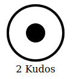

# Kudos - A simple like button that can be self-hosted



Kudos is similar to a like. By simply hovering over the button for a couple of seconds, a counter is inreased.
[Example](https://www.niels-ole.com/kudos/blog/2016/11/04/now-with-kudos.html)

## Usage

1. Download `kudosplease.min.js` and `kudosplease.css` from the `frontend` folder
2. Embed CSS and JS on your website
   ```
   <script src="kudosplease-min.js"></script>
   <link rel="stylesheet" href="kudosplease-min.css">
   ```
3. Create the widget: `<div class="kudos" data-amount="0" data-url="example.com/my-awesome-article"></div>`
4. Create the JS object:
   ```
   new KudosPlease({
    el : '.kudos',
    duration : 1500,
    persistent : true,
    status : {
      alpha: 'fontelico-emo-shoot',
      beta: 'fontelico-emo-shoot',
      gamma: 'fontelico-emo-beer'
    }
   });
   ```


## Self-Hosting

You need to change the API endpoint stored int the JavaScript. Simply search kudosplease.min.js for `kudos.niels-ole.com` and replace it with your API endpoint.

Kudos requires a redis database that stores the state.

```
  -port string
        Listening port (default ":8080")
  -redis-address string
        redis host and port (default "localhost:6379")
  -redis-db int
        redis db to use
  -redis-password string
        redis password
```

### Docker

```
registry.gitlab.com/nielsole/kudos/kudos
```

### From source

```
go build main.go
```

## Contributors / History

I really liked  http://kudosplease.com/ but their backend was really slow making it unusable, so I wrote my own.

Thanks to [Tim Pietrusky](https://github.com/TimPietrusky/) for creating kudos and publishing it under OSS.
